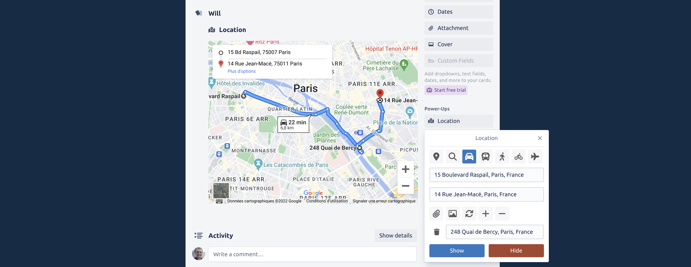
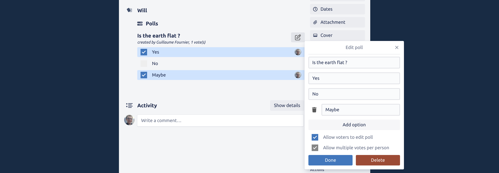
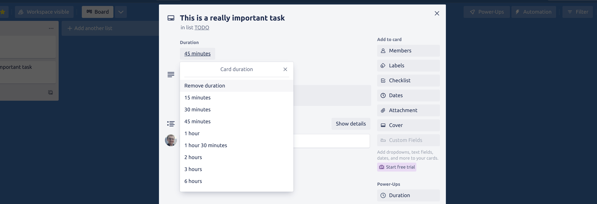
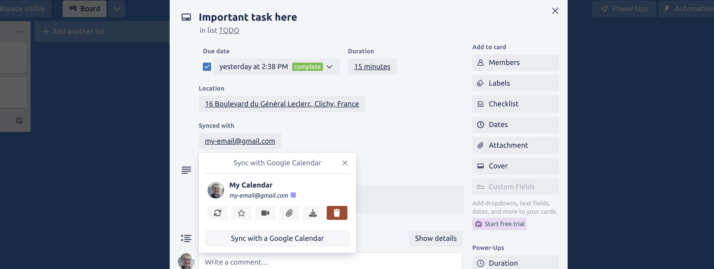
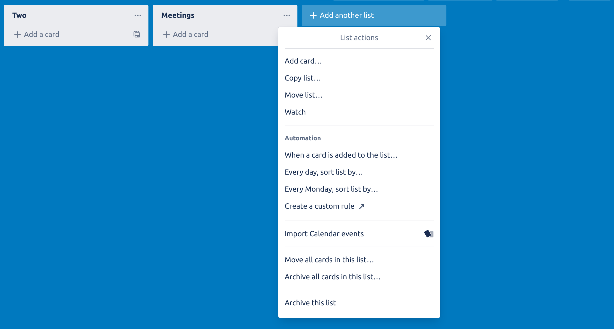
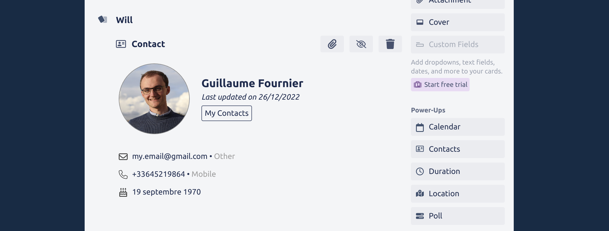

# Will's Power Up

This project is a custom Power-Up for my Trello boards. This Power-Up adds the following features:
- Store and visualize location and direction data for cards:

- Create polls:

- Add a duration to a card:

- 2-way sync of the name, description, location, Google Meet, response status (with note) and due date with a Google Calendar event

- Every month, all the cards in a configurable "Done" list can be automatically moved to another board, into a newly generated list, labeled by date. This feature requires that the user authorizes access to the Trello API, a button was added in the settings section of the Power-Up.
- A new "List action" was introduced so that you can pull all upcoming Google Calendar events to the list. The number of days to fetch from your calendar can be configured from the settings page. 

- Integration with Google People API so that you can add your Google contacts as context of a card.

## Getting started

### Add the Power-Up to your board

If you want to use this Power-Up as is:
- head to your Power-Ups admin page (👉 [https://trello.com/power-ups/admin](https://trello.com/power-ups/admin))
- create a new Power-Up with the following connector URL: [https://gui774ume.github.io/will-power-up](https://gui774ume.github.io/will-power-up)

You can also fork this repository, enable GitHub Pages on the main branch and follow the same steps as above, with your own connector URL.

### Provide a Google API Key

Some features of this Power-Up require a [Google API Key](https://cloud.google.com/docs/authentication/api-keys). You can configure this API key from the "settings" widget of the Power-Up.
Depending on which feature of the Power-Up you want to use, you'll need to configure your API key with the correct access rights.

We recommend you apply the following restrictions to your API key:
- Application restrictions: select `HTTP referrers (web sites)`
- Website restrictions: `gui774ume.github.io` (or your own domain)
- API restrictions:
  - The location and direction feature requires at least the `Maps Embed API`. If you want to enable the location autocomplete feature, add `Maps Javascript API` and `Places API` (monitor your usage, Google will make you pay for the autocomplete feature). You can disable the autocomplete feature from the settings of the Power-Up.
  - The calendar features require access to the `Google Calendar API`
  - The contact features require access to the `People API`